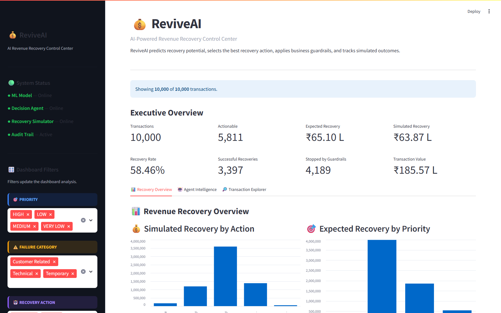
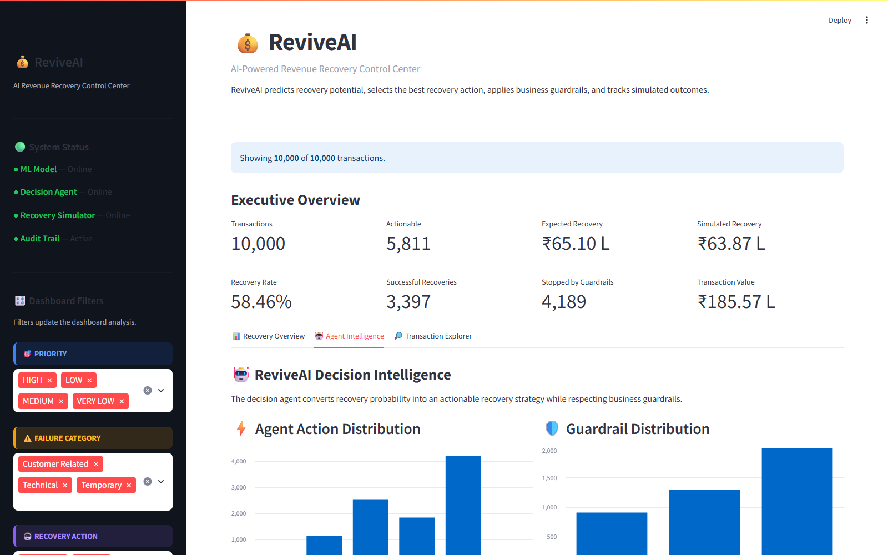
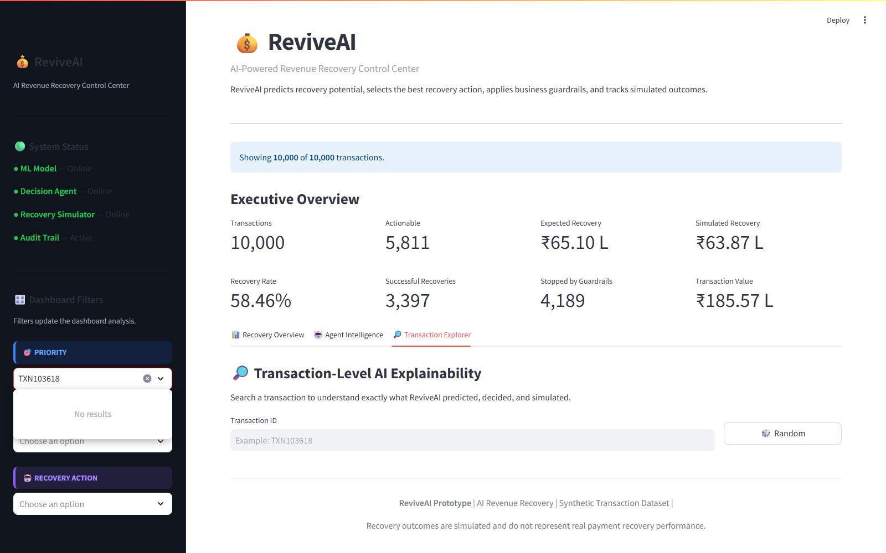

# 💰 ReviveAI

## 🤖 AI-Powered Revenue Recovery Decision Agent

**🎯 Track:** Track 3 — AI Revenue Recovery  
**🚀 Project:** ReviveAI

---

## 📌 Problem Statement

Failed payments create direct revenue loss for businesses. Not every failed transaction should be retried in the same way. Repeated retries can also increase customer friction and unnecessary payment attempts.

ReviveAI addresses this problem by identifying failed transactions that have recovery potential, predicting the probability of successful recovery, selecting an appropriate recovery action, applying business guardrails, and tracking the simulated outcome through an audit trail.

---

## 💡 Proposed Solution

ReviveAI is an AI-powered revenue recovery system that combines:

- 🧠 Machine Learning based recovery prediction
- 🤖 AI decision-agent logic
- 🔍 Failure reason analysis
- 🔄 Retry history analysis
- 🛡️ Business guardrails
- 💰 Recovery simulation
- 📝 Audit logging
- 📊 Interactive Streamlit dashboard

The system processes failed transactions in batches and determines whether recovery should be attempted and which action should be taken.

---

## 🔄 Recovery Pipeline

```text
💳 Failed Transactions
          ↓
🔍 Transaction Analysis
          ↓
🧠 ML Recovery Prediction
          ↓
🤖 AI Decision Agent
          ↓
🛡️ Business Guardrails
          ↓
⚡ Recovery Action
          ↓
💰 Recovery Simulation
          ↓
📝 Audit Logging
          ↓
📊 Dashboard
```

---

## 🤖 AI Decision System

The AI decision agent acts as the decision layer after the ML prediction.

It considers:

- 📈 Recovery probability
- ⚠️ Failure category and reason
- 💵 Transaction amount
- 🔄 Retry count
- 👤 Customer recovery potential
- 🛡️ Business rules

Based on these factors, the agent selects an appropriate recovery action.

### ⚡ Available Actions

- 🔄 Retry
- ⏳ Retry After Delay
- 📩 Send Payment Reminder
- 🚨 Escalate
- 💳 Suggest Alternate Payment Method
- 🛑 Stop Recovery

The current implementation is a **lightweight and bounded decision-agent architecture** rather than a fully autonomous agent.

---

## 🛡️ Business Guardrails

ReviveAI applies safety and business controls before recovery actions are executed.

### 🔐 Guardrails

- 🔄 Maximum Retry Limit
- 📉 Low Recovery Probability
- 👤 Low Customer Recovery Potential

These controls prevent unnecessary recovery attempts and help reduce repeated retries.

### 📊 Guardrail Validation

| 🛡️ Guardrail | 🔢 Transactions |
|---|---:|
| Maximum Retry Limit | 1,991 |
| Low Recovery Probability | 1,292 |
| Low Customer Recovery Potential | 906 |

---

## 💰 Recovery Simulation

The recovery engine simulates the outcome of selected recovery actions.

### 📊 Validation Results

- 📦 **Transactions Processed:** 10,000
- 🤖 **Recovery Decisions:** 10,000
- ⚡ **Actionable Transactions:** 5,811
- 🔄 **Recovery Attempts:** 5,811
- ✅ **Successful Recoveries:** 3,397
- 📈 **Recovery Rate:** 58.46%
- 💰 **Simulated Revenue Recovered:** ₹6,386,814.48
- 🎯 **Expected Recoverable Revenue:** ₹8,324,096.57

The simulation provides a measurable way to evaluate the effectiveness of the recovery strategy.

---

## 📊 Interactive Dashboard

The project includes an interactive **Streamlit dashboard** with three main sections.

### 📈 Recovery Overview

Provides a high-level view of:

- 💳 Total transactions
- 💰 Expected recoverable revenue
- ⚡ Actionable transactions
- 🔄 Recovery attempts
- ✅ Successful recoveries
- 💵 Simulated revenue recovered
- 📈 Recovery rate

### 🤖 Agent Intelligence

Shows:

- 📈 Recovery probability distribution
- 🎯 Recovery priority distribution
- ⚡ Recovery action distribution
- 🛡️ Guardrail activity
- 📊 Recovery performance by action

### 🔎 Transaction Explorer

Allows individual transactions to be explored using filters such as:

- 🎯 Recovery priority
- ⚠️ Failure reason
- ⚡ Recovery action
- 💳 Transaction details
- 📈 Recovery probability
- 💰 Expected recovery value

---

## 🧪 10,000 Transaction Validation

ReviveAI was tested on a synthetic dataset containing **10,000 failed payment transactions**.

### 📋 Dataset Summary

| 📌 Metric | 📊 Value |
|---|---:|
| 💳 Total Transactions | 10,000 |
| 💰 Total Transaction Value | ₹18,556,720.41 |
| 🎯 Expected Recoverable Revenue | ₹8,324,096.57 |
| ⚡ Actionable Transactions | 5,811 |
| 🛑 Stopped Transactions | 4,189 |
| ✅ Successful Recoveries | 3,397 |
| 💵 Simulated Revenue Recovered | ₹6,386,814.48 |
| 📈 Recovery Rate | 58.46% |

---

## ⚡ Recovery Action Distribution

| ⚡ Action | 🔢 Transactions |
|---|---:|
| 🛑 Stop Recovery | 4,189 |
| ⏳ Retry After Delay | 2,515 |
| 📩 Send Payment Reminder | 1,837 |
| 🔄 Retry | 1,131 |
| 🚨 Escalate | 321 |
| 💳 Suggest Alternate Payment Method | 7 |

---

## 📊 Recovery Performance by Action

| ⚡ Recovery Action | 🔄 Attempts | ✅ Successful | 📈 Recovery Rate |
|---|---:|---:|---:|
| 🚨 Escalate | 321 | 80 | 25% |
| 🔄 Retry | 1,131 | 658 | 58% |
| ⏳ Retry After Delay | 2,515 | 1,841 | 73% |
| 📩 Send Payment Reminder | 1,837 | 812 | 44% |
| 💳 Suggest Alternate Payment Method | 7 | 6 | 86% |

---

## 🧠 Machine Learning

The ML component predicts the probability that a failed transaction can be successfully recovered.

The prediction is used by the decision agent to determine the recovery priority and appropriate action.

### 📤 Model Output

Each transaction receives:

- 📈 Recovery probability
- 💰 Expected recovery value
- 🎯 Recovery priority
- ⚡ Recommended recovery action

The trained model is stored in:

```text
models/recovery_prediction_model.pkl
```

Model comparison results are stored in:

```text
models/model_comparison.csv
```

---

## 🔗 End-to-End Workflow

1. 💳 Load failed payment transactions.
2. 🔍 Analyze transaction and failure characteristics.
3. 🧠 Predict recovery probability using the ML model.
4. 💰 Estimate expected recoverable value.
5. 🤖 Pass the prediction and transaction information to the decision agent.
6. ⚡ Select the appropriate recovery action.
7. 🛡️ Apply business guardrails.
8. 🧪 Simulate the recovery outcome.
9. 📝 Record the decision and outcome in the audit log.
10. 📊 Display results through the Streamlit dashboard.

---

## 📁 Project Structure

```text
ReviveAI/
│
├── 📄 README.md
├── ⚙️ .gitignore
│
├── 📊 dashboards/
│   └── app.py
│
├── 💾 data/
│   ├── transactions.csv
│   ├── agent_decisions.csv
│   ├── recovery_results.csv
│   ├── audit_log.csv
│   └── generate_dataset.py
│
├── 🧠 models/
│   ├── recovery_prediction_model.pkl
│   └── model_comparison.csv
│
├── 🤖 src/
│   ├── recovery_agent.py
│   ├── recovery_simulator.py
│   ├── batch_recovery_engine.py
│   ├── audit_logger.py
│   ├── train_recovery_model.py
│   └── test_agent_batch.py
│
├── 🧪 tests/
│   └── capture_dashboard.py
│
└── 🖼️ docs/
    ├── dashboard_overview.png
    ├── agent_intelligence.png
    └── transaction_explorer.png
```

---

## 🖼️ Dashboard Screenshots

### 📈 Recovery Overview



### 🤖 Agent Intelligence



### 🔎 Transaction Explorer



---

## 🛠️ Technology Stack

- 🐍 **Python** — Core implementation
- 🧠 **Scikit-learn** — Machine learning
- 🐼 **Pandas** — Data processing
- 📊 **Streamlit** — Interactive dashboard
- 💾 **Joblib** — Model persistence
- 📄 **CSV** — Transaction, recovery, and audit data storage

---

## 🚀 Running the Project

### 1️⃣ Clone the Repository

```bash
git clone https://github.com/naisha-nitin-uchil/ReviveAI.git
cd ReviveAI
```

### 2️⃣ Install Dependencies

```bash
pip install pandas scikit-learn streamlit joblib
```

### 3️⃣ Run the Dashboard

```bash
streamlit run dashboards/app.py
```

The dashboard will open in the browser. 🌐

---

## 🔍 Example Recovery Decision

A high-value failed transaction can be evaluated by the system using its failure reason, recovery probability, transaction value, and retry history.

### 💳 Example

```text
Transaction: TXN103618
Amount: ₹18,532.75
Failure Reason: Gateway Timeout
Recovery Probability: 0.832
Expected Recovery: ₹15,426.59
Priority: HIGH
Action: Retry After Delay
```

This demonstrates how the prediction and decision layers work together to select a targeted recovery strategy.

---

## 🛡️ Safety and Control

ReviveAI is designed around **bounded recovery decisions**.

The system does not blindly retry every failed transaction. Instead, it:

- 🔍 Evaluates recovery potential
- 🎯 Selects targeted recovery actions
- 🔄 Applies retry limits
- 🛑 Stops low-potential recovery attempts
- 📝 Records decisions and outcomes
- 📋 Maintains an audit trail

This provides a controlled approach to automated revenue recovery.

---

## ✅ Project Status

**🚀 Status: Working Prototype**

The current prototype includes:

- 📊 Synthetic transaction dataset
- 🧠 ML recovery prediction
- 🤖 AI decision-agent layer
- 🛡️ Business guardrails
- ⚙️ Batch recovery engine
- 🧪 Recovery simulation
- 📝 Audit logging
- 📊 Interactive Streamlit dashboard
- 🔎 Transaction-level exploration
- 🐙 GitHub-ready project structure

---

## ⚠️ Disclaimer

This project uses **synthetic transaction data** and **simulated recovery outcomes** for demonstration and evaluation purposes.

It is not connected to real payment processing systems or real customer payment data.

---

## 🏆 Project

### 💰 ReviveAI — AI-Powered Revenue Recovery Decision Agent

Built for **Razorpay AI Builder Internship 2026 — Track 3: AI Revenue Recovery**. 🚀
